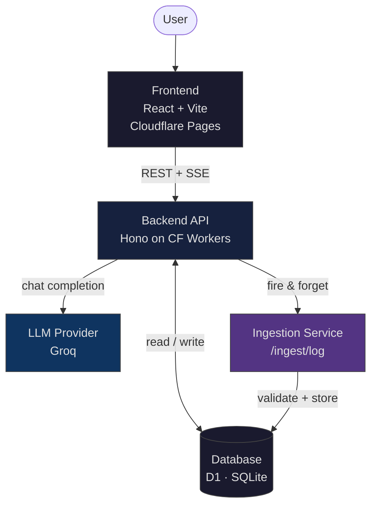
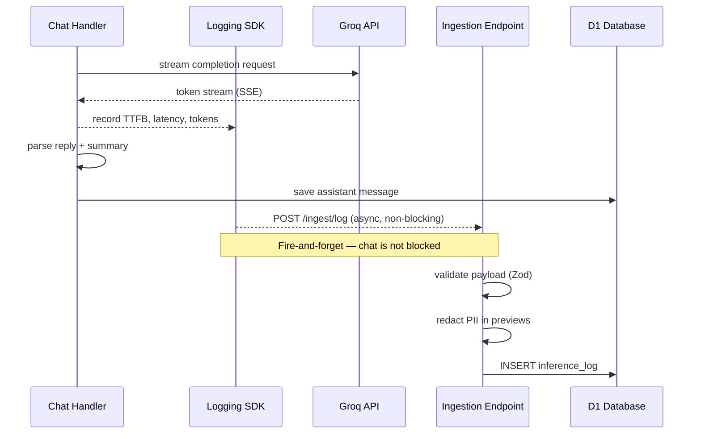
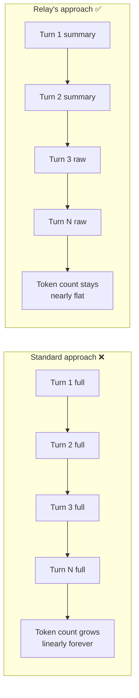
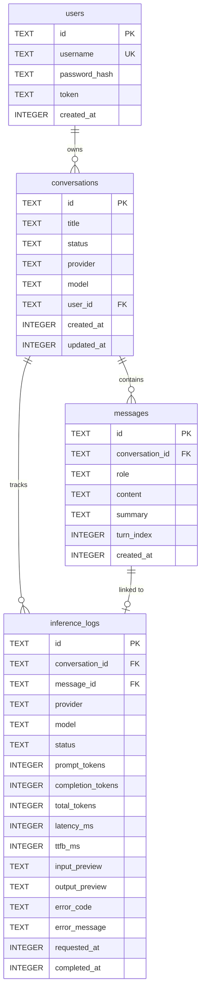

# ⚡ Relay — AI Chat Assistant with Inference Logging

> A production-ready, full-stack AI chatbot with multi-provider support, smart context compression, and comprehensive inference observability — built on Cloudflare's edge infrastructure.

**Stack:** React · Hono · Cloudflare Workers · D1 · Groq

---

## Table of Contents

- [Features](#-features)
- [Architecture](#-architecture)
- [Ingestion Pipeline](#-ingestion-pipeline)
- [Self-Summarising Memory](#-self-summarising-memory)
- [Schema Design](#-schema-design)
- [Tradeoffs](#-tradeoffs)
- [Local Development](#-local-development)
- [Deployment](#-deployment)
- [What I'd Improve](#-what-id-improve-with-more-time)

---

## ✨ Features

| Feature                     | Description                                                                |
| --------------------------- | -------------------------------------------------------------------------- |
| 🤖 Multi-turn conversations | Persistent message history with smart context compression                  |
| 🧠 Self-summarising memory  | Assistant compresses its own replies inline — zero extra API calls         |
| 🎛️ Model switching          | Swap LLM models per message with friendly nicknames                        |
| 📊 Observability dashboard  | Per-user analytics — latency, token usage, error rates, model distribution |
| 🔐 JWT authentication       | Signup / login / protected routes                                          |
| 🏷️ Auto-generated titles    | Every conversation gets a smart title (≤ 3 words) after the first exchange |
| 🌓 Dark theme UI            | Custom scrollbar, responsive sidebar, full mobile support                  |
| ☁️ Cloud-native             | Workers (backend) + Pages (frontend) + D1 (database) — zero cold starts    |

---

## 🏗️ Architecture

Relay is split into four distinct layers: a React frontend, a Hono-based edge API, a dedicated ingestion pipeline, and a D1-backed database. All backend code runs on Cloudflare Workers with a Node.js-compatible local development path — same codebase, different adapters.



### Layer Responsibilities

**Frontend** — React + TypeScript + Tailwind CSS, compiled with Vite and served via Cloudflare Pages. Communicates with the backend over REST for CRUD operations and Server-Sent Events (SSE) for streaming responses.

**Backend API** — Hono framework running on Cloudflare Workers. Handles authentication, conversation management, and LLM orchestration. Uses a shared `DbAdapter` interface so the same route handlers work against both D1 (production) and SQLite (local dev) without modification.

**SDK / Logging Middleware** — A thin wrapper around every LLM call that captures tokens, latency, TTFB, provider, model, and error info. Logs are dispatched fire-and-forget to the ingestion endpoint — the chat response is never delayed.

**Ingestion Pipeline** — A dedicated route (`/ingest/*`) that receives, validates (Zod), and stores inference logs. Exposes aggregate stats for the dashboard. Completely decoupled from the chat path — a logging failure cannot affect a user's conversation.

**Database** — Cloudflare D1 in production (globally replicated SQLite), `sql.js` locally. A common `DbAdapter` interface abstracts both.

---

## 🔄 Ingestion Pipeline



**Key design decisions:**

- Logs are sent **after** the response is streamed to the user — zero latency impact
- **PII redaction** runs on `input_preview` / `output_preview` before storage (emails, phone numbers, card numbers stripped via regex)
- Duplicate log IDs are silently ignored (`INSERT OR IGNORE`) — safe to retry
- Validation errors return structured 400s, useful during SDK development

---

## 🧠 Self-Summarising Memory

One of the core technical contributions of Relay is its approach to context management. Instead of replaying the full message history on every turn (which causes context size — and therefore cost and latency — to grow unboundedly), the assistant generates a compact one-sentence summary of its own response inline, as part of the same generation.



### How it works

The system prompt instructs the model to always respond with structured JSON:

```json
{
  "reply": "Full assistant response shown to the user.",
  "summary": "One-sentence compressed memory of this reply."
}
```

When building context for the next turn, Relay uses a sliding window strategy:

```
System prompt
+ Summaries for turns [0 … N-3]    ← compressed, cheap
+ Raw messages for turns [N-2 … N]  ← verbatim, preserves intent
```

**Why this works well:**

- Zero additional API calls — the summary is part of the same completion
- Assistant messages are far longer than user messages, so compressing them specifically yields the best token savings
- Graceful fallback — if JSON parsing fails, the raw response is used as-is

**Known tradeoffs:**

- Very long conversations may experience slight summary drift over many turns
- Requires a capable model to reliably produce structured JSON output (handled with `response_format` and a robust fallback parser)

---

## 🗄️ Schema Design



### Design Rationale

**UUIDs everywhere** — All primary keys are UUID v4. No autoincrement integers that would clash across distributed writes or expose sequential IDs to clients.

**`conversations.status` over hard delete** — Conversations are soft-cancelled (`status = 'cancelled'`), never hard-deleted. This keeps inference logs and analytics intact even after a conversation ends, and allows future "resume" semantics without data loss.

**`messages.summary` column** — Stores the assistant's self-generated memory summary alongside the full content. The full content is shown to the user; the summary is used for context reconstruction. This means the memory strategy is entirely a query-time concern — no separate table, no join.

**`messages.turn_index`** — An explicit ordering column rather than relying on `created_at` for sorting. Timestamps can collide or drift; `turn_index` is monotonically correct by construction.

**`inference_logs.ttfb_ms`** — Time-to-first-byte is tracked separately from total latency. This is the metric users actually feel — a response that starts streaming in 300ms feels fast even if it takes 3s to complete.

**`input_preview` / `output_preview`** — Truncated to 200 characters and PII-redacted before storage. Enough to debug a bad inference; not enough to reconstruct a full conversation from logs alone.

**Indexes on hot query paths:**

```sql
CREATE INDEX idx_messages_conversation   ON messages(conversation_id, turn_index);
CREATE INDEX idx_inference_conversation  ON inference_logs(conversation_id);
CREATE INDEX idx_inference_requested_at  ON inference_logs(requested_at);
CREATE INDEX idx_conversations_updated   ON conversations(updated_at DESC);
```

---

## ⚖️ Tradeoffs

| Decision                             | Rationale                                                                                                                                  | What's Sacrificed                                                                                                                |
| ------------------------------------ | ------------------------------------------------------------------------------------------------------------------------------------------ | -------------------------------------------------------------------------------------------------------------------------------- |
| **Cloudflare D1 over Postgres**      | Zero cold starts, native Workers integration, free tier, globally replicated                                                               | Less mature than Postgres; no full-text search; limited to SQLite dialect                                                        |
| **D1 + sql.js adapter pattern**      | Same codebase runs locally and in production, no environment-specific code in routes; sql.js needs no native bindings so it works anywhere | D1 write latency is eventually consistent across regions; sql.js runs in-memory so local state resets on process exit            |
| **Fire-and-forget log ingestion**    | Logging never blocks or delays the chat response                                                                                           | In theory, logs can be lost if the worker dies mid-flight. Acceptable for v1; a durable queue (Cloudflare Queues) would fix this |
| **Self-summarising memory over RAG** | No vector DB, no extra API calls, no infrastructure overhead                                                                               | May drift over very long sessions; depends on model JSON reliability                                                             |
| **Synchronous title generation**     | Sidebar title updates immediately after first exchange                                                                                     | Adds ~200ms to the first assistant response of a new conversation                                                                |
| **JWT auth over OAuth**              | Fast to implement, no third-party dependency                                                                                               | No SSO, no password reset flows — acceptable scope for v1                                                                        |
| **No rate limiting**                 | Simplifies the initial implementation                                                                                                      | Abuse potential in production; Cloudflare Workers Rate Limiting API makes this a one-liner to add                                |
| **Single-region deployment**         | Simpler to reason about, no replication lag concerns                                                                                       | Higher latency for users far from the deployed region; mitigatable with Workers Smart Placement                                  |

---

## 🔧 Local Development

### Prerequisites

- Node.js 18+
- npm
- Groq API key — [console.groq.com](https://console.groq.com)

### Install & run

```bash
git clone https://github.com/10billionpercent/relay
cd relay

# Install all dependencies
npm install

# Configure environment
cp .env.example .env
# → Set GROQ_API_KEY in .env

# Start both frontend and backend
npm run dev
```

| Service  | URL                   |
| -------- | --------------------- |
| Frontend | http://localhost:5173 |
| Backend  | http://localhost:3001 |

The local backend uses `sql.js` (a WebAssembly port of SQLite — no native bindings, works on any OS out of the box). The database is stored in memory and persisted to `data/relay.db` on shutdown. Delete the file to reset all state.

### Running database migrations locally

```bash
npm run db:migrate:local
```

---

### Using Docker

You can also run the entire stack with Docker Compose. A Dockerfile and docker-compose.yml are already included in the repository.

#### Create .env with your Groq API key

```
echo "GROQ_API_KEY=gsk_your_key_here" > .env
```

#### Build and start both services

```
docker-compose up --build
```

Open `http://localhost:5173` for the frontend. The backend is available at `http://localhost:3001`.

#### Running database migrations locally

```
npm run db:migrate:local
```

---

## ☁️ Deployment

Relay is deployed entirely on Cloudflare's infrastructure — no servers to manage, no cold starts.

### Backend — Workers + D1

The backend is deployed as a Cloudflare Worker via Wrangler. A D1 database (`relay`) was provisioned and its ID bound in `wrangler.toml`. The schema was applied with:

```bash
wrangler d1 execute relay --remote --file=./schema.sql
```

Secrets (`GROQ_API_KEY`, `JWT_SECRET`) are stored as Worker secrets — never in source control. The Worker is deployed to Cloudflare's global edge network and routes all `/api/*` traffic.

### Frontend — Cloudflare Pages

The React frontend is deployed via Cloudflare Pages, connected directly to this repository. On every push to `main`, Pages builds and deploys automatically.

| Setting          | Value                                                  |
| ---------------- | ------------------------------------------------------ |
| Build command    | `cd packages/frontend && npm install && npm run build` |
| Output directory | `packages/frontend/dist`                               |
| `VITE_API_URL`   | Bound to the deployed Worker URL at build time         |

The frontend and backend share the same `.workers.dev` domain, so there are no CORS issues in production.

---

## 📈 What I'd Improve with More Time

**Reliability**

- Replace fire-and-forget log delivery with **Cloudflare Queues** — guaranteed at-least-once delivery, automatic retries, and a dead-letter queue for failed ingestion
- Add **idempotent message writes** on the frontend to handle network retries gracefully

**Observability**

- Real-time **latency percentile tracking** (p50 / p95 / p99) rather than averages, which are misleading for LLM workloads
- **Cost tracking** — map token counts to actual USD cost per model so the dashboard shows real spend

**Scale**

- **Cloudflare Workers Smart Placement** — automatically routes requests to the Worker instance closest to the upstream LLM API, reducing round-trip latency
- **Read replicas** once D1 supports them natively — analytics queries should not contend with write paths

**Product**

- **Streaming responses** — SSE is wired in on the backend; the frontend needs a streaming renderer
- **Full-text search** across conversation history (SQLite FTS5 extension)
- **Multimodal input** — image and file upload via vision-capable models
- **OAuth2 / SSO** — replace the custom token auth with a proper identity provider
- **Keyboard shortcuts** and message action buttons (copy, regenerate, branch conversation)
- **PII redaction improvements** — move from regex to a lightweight NLP-based classifier for higher recall

**Testing**

- Unit tests for the logging SDK and ingestion pipeline
- End-to-end tests with Playwright covering the core conversation flow

---

_Built by [Shreya V] · [shreya501711@gmail.com]_
